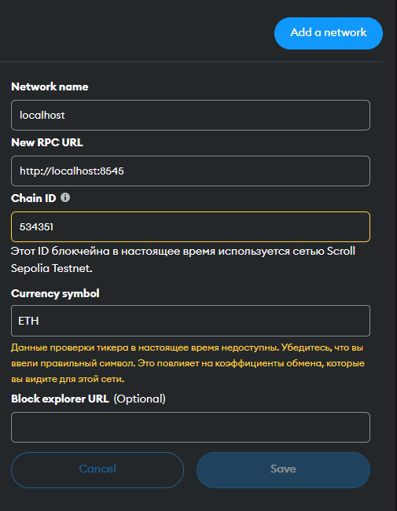

# Getting Started for foundry

## Requirements

Please install the following:

- [Git](https://git-scm.com/book/en/v2/Getting-Started-Installing-Git)
  - You'll know you've done it right if you can run `git --version`
- [Foundry / Foundryup](https://github.com/gakonst/foundry)
  - This will install `forge`, `cast`, and `anvil`. [Installation Instructions](https://book.getfoundry.sh/getting-started/installation)
  - You can test you've installed them right by running `forge --version`

## Quickstart

```sh
git clone https://github.com/https://github.com/bimkon144/foundry-scroll-fork.git
cd FOUNDRY-SCROLL-FORK
forge install
```
# Run fork of scroll testnet

## Setup

You need to create a file `.env` in the project and add the following variables to it:

- `PRIVATE_KEY`: A private key from your deploying wallet. For local testing  - we can use the same as in .env.example.

## Deploying

To Run fork of scroll testnet - `anvil --fork-url="https://scroll-sepolia.blockpi.network/v1/rpc/public" --fork-block-number=2877322  -b=5 --chain-id=534351`
Open new terminal and run deploy script - `forge script script/Deploy.s.sol:Deploy --rpc-url=http://localhost:8545 --broadcast`

Scroll up and see `== Logs ==` with your token names and their addresses.

## SetUp Metamask

Go to metamask network setting and add new one - localhost: 


Now switch your network to the localhost and do things:

- click `add account` and then `import account`. Put private key from your .env.example (its local account with a lot of eth).
- press `import tokens` and put each of token contracts we deployed earlier.